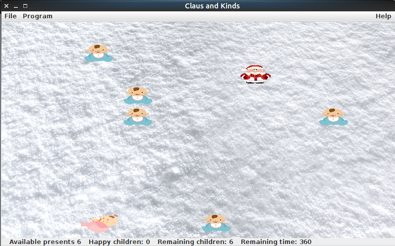
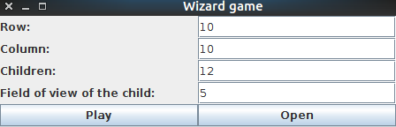

# ClausAndKids
<i>Realizacja gry "mikołak i dzieciaki" w grafice dwuwymiarowej z użyciem swing.  Obiekty pojawiające się na mapie są reprezentowane przez synchronizuje się osobne wątki.</i>   

Tresc zadania w <i>zad8.pdf</i> 
Rozszerzenie zadania:
<ul>
<li>Gra jest na czas, użytkownik ma po 4s dla każdego dzieciaka, na rozdanie prezentów</li>
<li>Okno z grą może być skalowane</li>
<li>Maksymalna ilość prezentów jakie może rozdać mikołaj to ilość dzieci na planszy</li>
<li>Możliwość zatrzymania i wznowienia gry</li>
<li>Możliwość zabrania prezentu z planszy</li>
</ul>

<b>Widok z gry</b> 

<b>Tworzenie gry</b> 

